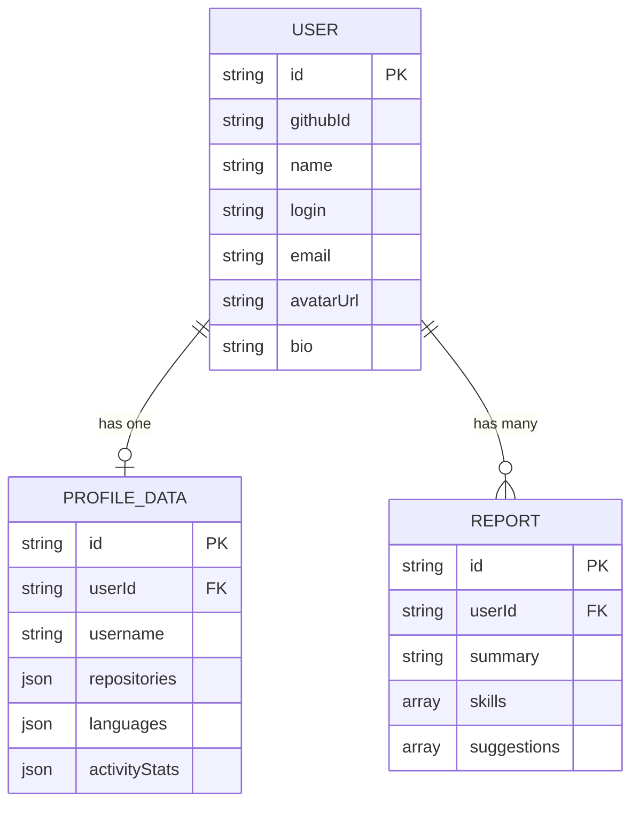

```mermaid
erDiagram
    USER {
        string id PK
        string githubId
        string name
        string login
        string email
        string avatarUrl
        string bio
    }

    PROFILE_DATA {
        string id PK
        string userId FK
        string username
        json repositories
        json languages
        json activityStats
    }

    REPORT {
        string id PK
        string userId FK
        string summary
        array skills
        array suggestions
    }

    USER ||--o| PROFILE_DATA : "has one"
    USER ||--o{ REPORT : "has many"
```
