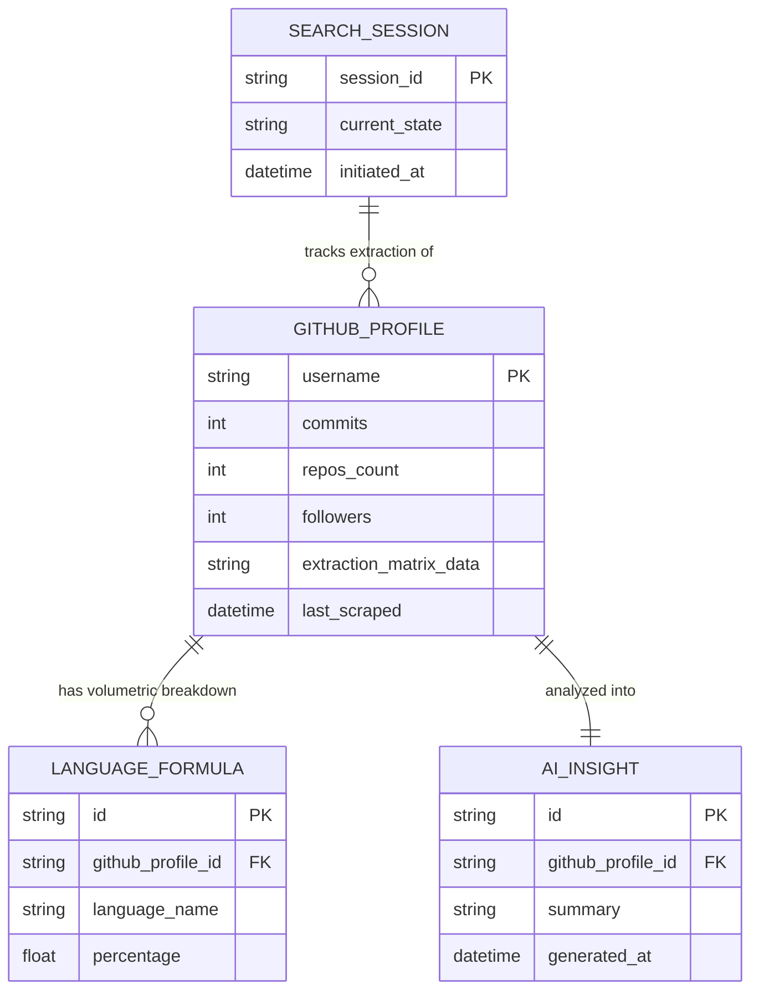

```mermaid
erDiagram
    SEARCH_SESSION {
        string session_id PK
        string current_state
        datetime initiated_at
    }

    GITHUB_PROFILE {
        string username PK
        int commits
        int repos_count
        int followers
        string extraction_matrix_data
        datetime last_scraped
    }

    LANGUAGE_FORMULA {
        string id PK
        string github_profile_id FK
        string language_name
        float percentage
    }

    AI_INSIGHT {
        string id PK
        string github_profile_id FK
        string summary
        datetime generated_at
    }

    SEARCH_SESSION ||--o{ GITHUB_PROFILE : "tracks extraction of"
    GITHUB_PROFILE ||--o{ LANGUAGE_FORMULA : "has volumetric breakdown"
    GITHUB_PROFILE ||--|| AI_INSIGHT : "analyzed into"
```
