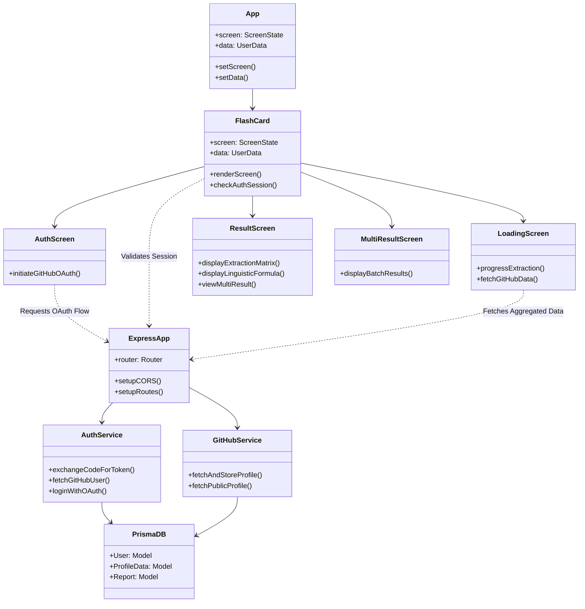

```mermaid
classDiagram

    %% Frontend Components
    class App {
        +screen: ScreenState
        +data: UserData
        +setScreen()
        +setData()
    }

    class FlashCard {
        +screen: ScreenState
        +data: UserData
        +renderScreen()
        +checkAuthSession()
    }

    class AuthScreen {
        +initiateGitHubOAuth()
    }

    class LoadingScreen {
        +progressExtraction()
        +fetchGitHubData()
    }

    class ResultScreen {
        +displayExtractionMatrix()
        +displayLinguisticFormula()
        +viewMultiResult()
    }

    class MultiResultScreen {
        +displayBatchResults()
    }

    %% Backend Services
    class ExpressApp {
        +router: Router
        +setupCORS()
        +setupRoutes()
    }

    class AuthService {
        +exchangeCodeForToken()
        +fetchGitHubUser()
        +loginWithOAuth()
    }

    class GitHubService {
        +fetchAndStoreProfile()
        +fetchPublicProfile()
    }

    class PrismaDB {
        +User: Model
        +ProfileData: Model
        +Report: Model
    }
    
    App --> FlashCard
    FlashCard --> AuthScreen
    FlashCard --> LoadingScreen
    FlashCard --> ResultScreen
    FlashCard --> MultiResultScreen
    
    AuthScreen ..> ExpressApp : Requests OAuth Flow
    FlashCard ..> ExpressApp : Validates Session
    LoadingScreen ..> ExpressApp : Fetches Aggregated Data
    
    ExpressApp --> AuthService
    ExpressApp --> GitHubService
    AuthService --> PrismaDB
    GitHubService --> PrismaDB
```
