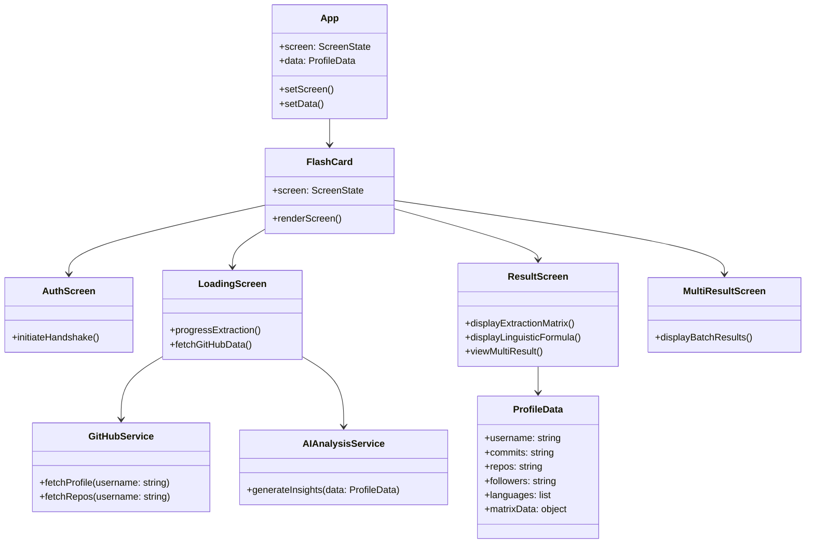

```mermaid
classDiagram

    class App {
        +screen: ScreenState
        +data: ProfileData
        +setScreen()
        +setData()
    }

    class FlashCard {
        +screen: ScreenState
        +renderScreen()
    }

    class AuthScreen {
        +initiateHandshake()
    }

    class LoadingScreen {
        +progressExtraction()
        +fetchGitHubData()
    }

    class ResultScreen {
        +displayExtractionMatrix()
        +displayLinguisticFormula()
        +viewMultiResult()
    }

    class MultiResultScreen {
        +displayBatchResults()
    }

    class GitHubService {
        +fetchProfile(username: string)
        +fetchRepos(username: string)
    }

    class AIAnalysisService {
        +generateInsights(data: ProfileData)
    }

    class ProfileData {
        +username: string
        +commits: string
        +repos: string
        +followers: string
        +languages: list
        +matrixData: object
    }
    
    App --> FlashCard
    FlashCard --> AuthScreen
    FlashCard --> LoadingScreen
    FlashCard --> ResultScreen
    FlashCard --> MultiResultScreen
    LoadingScreen --> GitHubService
    LoadingScreen --> AIAnalysisService
    ResultScreen --> ProfileData
```
