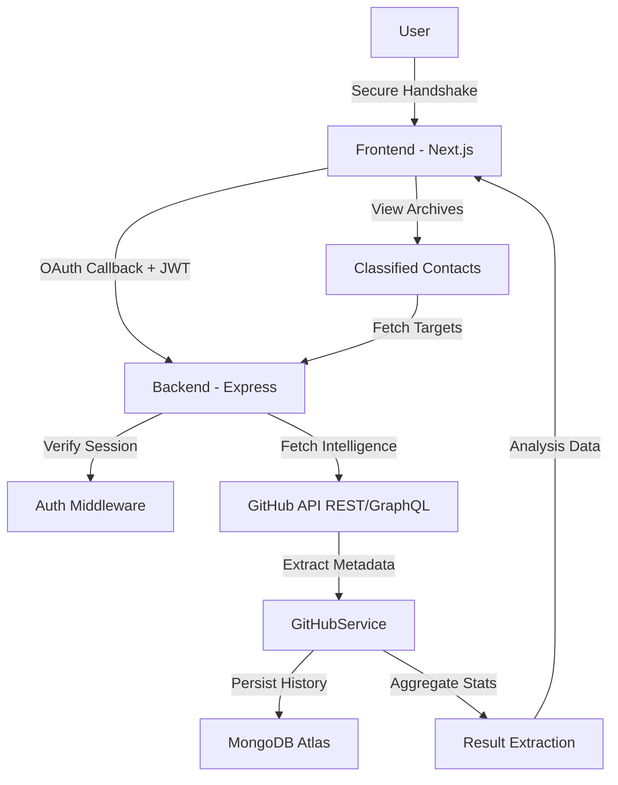

# 🕶️ Git Analyser: Marginal Extraction


A highly stylized, finite-state-machine (FSM) driven web application designed to act as an "encrypted portal" for analyzing GitHub developers' public profiles. The system features a brutalist, espionage-themed aesthetic, evaluating coder activity and projecting it via "Extraction Matrices" and "Linguistic Formulas."

---

## 📐 System Architecture



---

## ⚡ Core Features

- 🛡️ **State-Driven Architecture**: Trades traditional page routing for a React multi-screen Finite State Machine (`AUTH` → `LOADING` → `RESULT` → `MULTI_RESULT`).
- 💻 **Encrypted Portal UI**: Operates via a "Secure Handshake" interface with strict brutalist styling and terminal-like diagnostics.
- 📂 **Classified Contacts**: A global search history feature that persists every analyzed subject. Data is uniquely indexed to ensure a clean database of intelligence.
- 📊 **Extraction Matrix**: A visual heat-map block simulating complex codebase analysis based on real GitHub commit activity.
- 🧮 **Linguistic Formula**: Translates programming languages into a volumetric composition bar chart using external aggregation.
- 🔄 **Seamless Loading Flow**: Animated transitions showing faux trace routes, latency data, and system logs while data decodes.
- 🚀 **Automated CI/CD**: Integrated GitHub Actions pipeline for automated linting, type-checking, and build validation.

---

## 📂 Project Structure

```text
sesd-project-sem4/
├── .github/workflows/        # CI/CD Automation
│   └── ci.yml                # Build & Lint Pipeline
├── backend/                  # Express.js API server
│   ├── prisma/               # Database schema & SearchHistory models
│   │   └── schema.prisma
│   ├── src/
│   │   ├── index.ts          # Main server & /api/targets routes
│   │   └── services/         # Business logic layer
│   │       ├── AuthService.ts
│   │       └── GitHubService.ts
│   └── tsconfig.json         # Backend TS configuration
├── gitanalyser/              # Next.js SPA Frontend
│   ├── src/
│   │   ├── app/              # App Router & Global Styles
│   │   ├── components/       # UI Components
│   │   │   ├── FlashCard.tsx # FSM Router
│   │   │   └── screens/      # Thematic UI States
│   │       ├── AuthScreen.tsx
│   │       ├── LoadingScreen.tsx
│   │       ├── MultiResultScreen.tsx (Classified Contacts)
│   │       └── ResultScreen.tsx
│   │   └── types/            # Unified Type System (AppData/ProfileData)
│   └── next.config.ts
└── Docs/                     # Technical Documentation & Diagrams
```

---

## 🛠️ Technology Stack

| Layer | Technology |
|-------------------|------------|
| **Frontend** | Next.js 15+, React, Tailwind CSS |
| **Backend** | Node.js (v22), Express.js |
| **Database** | MongoDB Atlas, Prisma ORM |
| **Authentication** | GitHub OAuth 2.0, JWT (Cookie-based) |
| **Validation** | GitHub Actions (Automated CI) |

---

## 🚀 Getting Started

### Prerequisites
- Node.js 22.x
- MongoDB Instance
- GitHub OAuth App Credentials

### Setup
1. **Install Dependencies**:
   ```bash
   cd backend && npm install
   cd ../gitanalyser && npm install
   ```
2. **Database Initialization**:
   ```bash
   cd backend
   npx prisma generate
   ```
3. **Run Environment**:
   ```bash
   # Terminal 1
   cd backend && npm run dev
   # Terminal 2
   cd gitanalyser && npm run dev
   ```

---

## 🎯 Project Roadmap

1. **AI Threat Assessment**: Integrate HuggingFace/OpenAI to generate natural language intelligence reports from extraction data.
2. **Side-by-Side Comparison**: Enhance the `MULTI_RESULT` screen to allow comparative analysis of two operatives.
3. **Encrypted Export**: Allow "Cold Storage" downloads of profile analysis as PDF/JSON files.

---
*End of Document. Authorization Required for edits.*
