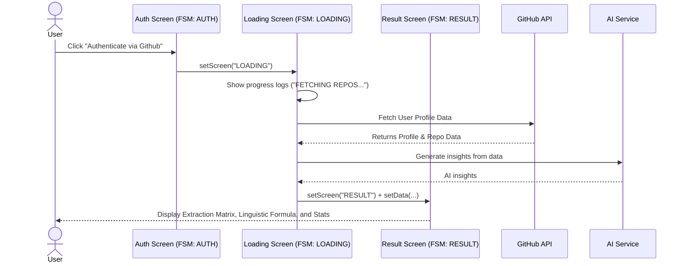

```mermaid
sequenceDiagram
    actor User
    participant AuthScreen as Auth Screen (FSM: AUTH)
    participant LoadingScreen as Loading Screen (FSM: LOADING)
    participant ResultScreen as Result Screen (FSM: RESULT)
    participant GitHubAPI as GitHub API
    participant AIService as AI Service

    User->>AuthScreen: Click "Authenticate via Github"
    AuthScreen->>LoadingScreen: setScreen("LOADING")
    
    LoadingScreen->>LoadingScreen: Show progress logs ("FETCHING REPOS...")
    LoadingScreen->>GitHubAPI: Fetch User Profile Data
    GitHubAPI-->>LoadingScreen: Returns Profile & Repo Data
    
    LoadingScreen->>AIService: Generate insights from data
    AIService-->>LoadingScreen: AI insights
    
    LoadingScreen->>ResultScreen: setScreen("RESULT") + setData(...)
    
    ResultScreen-->>User: Display Extraction Matrix, Linguistic Formula, and Stats
```
