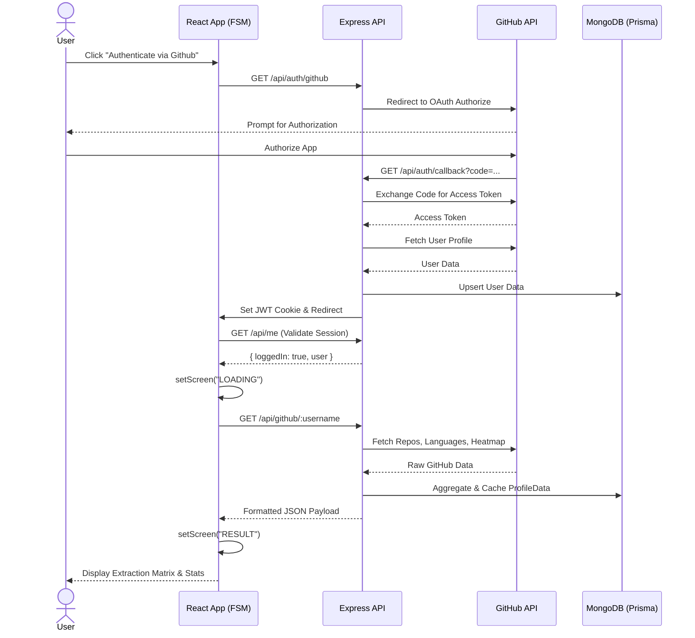

```mermaid
sequenceDiagram
    actor User
    participant Frontend as React App (FSM)
    participant Backend as Express API
    participant GitHub as GitHub API
    participant DB as MongoDB (Prisma)

    User->>Frontend: Click "Authenticate via Github"
    Frontend->>Backend: GET /api/auth/github
    Backend->>GitHub: Redirect to OAuth Authorize
    GitHub-->>User: Prompt for Authorization
    User->>GitHub: Authorize App
    GitHub->>Backend: GET /api/auth/callback?code=...
    
    Backend->>GitHub: Exchange Code for Access Token
    GitHub-->>Backend: Access Token
    Backend->>GitHub: Fetch User Profile
    GitHub-->>Backend: User Data
    
    Backend->>DB: Upsert User Data
    Backend->>Frontend: Set JWT Cookie & Redirect
    
    Frontend->>Backend: GET /api/me (Validate Session)
    Backend-->>Frontend: { loggedIn: true, user }
    Frontend->>Frontend: setScreen("LOADING")
    
    Frontend->>Backend: GET /api/github/:username
    Backend->>GitHub: Fetch Repos, Languages, Heatmap
    GitHub-->>Backend: Raw GitHub Data
    Backend->>DB: Aggregate & Cache ProfileData
    Backend-->>Frontend: Formatted JSON Payload
    
    Frontend->>Frontend: setScreen("RESULT")
    Frontend-->>User: Display Extraction Matrix & Stats
```
