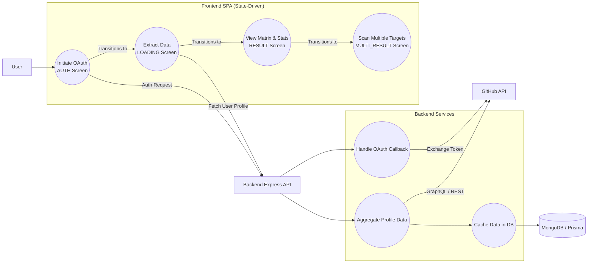

```mermaid
flowchart LR
    User[User]
    BackendAPI[Backend Express API]
    GitHubAPI[GitHub API]
    DB[(MongoDB / Prisma)]

    subgraph "Frontend SPA (State-Driven)"
        UC1((Initiate OAuth \nAUTH Screen))
        UC2((Extract Data \nLOADING Screen))
        UC3((View Matrix & Stats \nRESULT Screen))
        UC5((Scan Multiple Targets \nMULTI_RESULT Screen))
    end

    subgraph "Backend Services"
        UC6((Handle OAuth Callback))
        UC7((Aggregate Profile Data))
        UC8((Cache Data in DB))
    end

    User --> UC1
    UC1 -->|Transitions to| UC2
    UC2 -->|Transitions to| UC3
    UC3 -->|Transitions to| UC5

    UC1 -->|Auth Request| BackendAPI
    BackendAPI --> UC6
    UC6 -->|Exchange Token| GitHubAPI
    
    UC2 -->|Fetch User Profile| BackendAPI
    BackendAPI --> UC7
    UC7 -->|GraphQL / REST| GitHubAPI
    UC7 --> UC8
    UC8 --> DB
```
