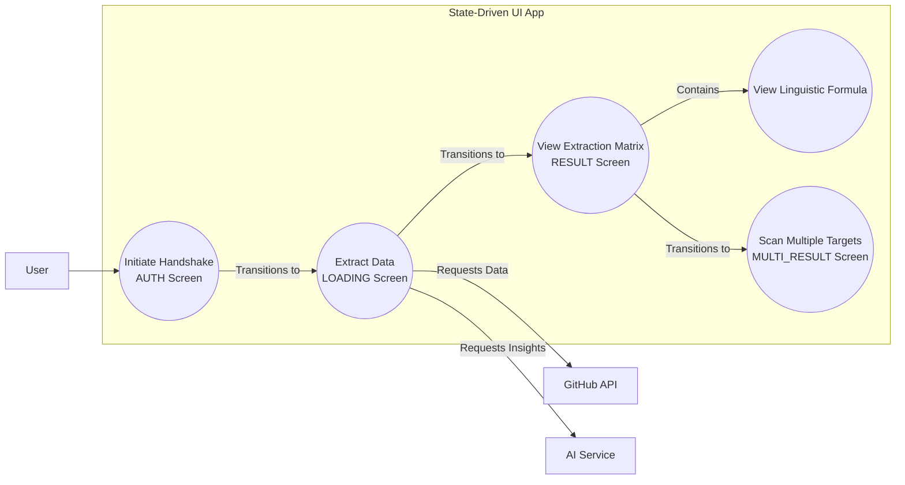

```mermaid
flowchart LR
    User[User]
    GitHubAPI[GitHub API]
    AI[AI Service]

    subgraph "State-Driven UI App"
        UC1((Initiate Handshake \nAUTH Screen))
        UC2((Extract Data \nLOADING Screen))
        UC3((View Extraction Matrix \nRESULT Screen))
        UC4((View Linguistic Formula))
        UC5((Scan Multiple Targets \nMULTI_RESULT Screen))
    end

    User --> UC1
    UC1 -->|Transitions to| UC2
    UC2 -->|Transitions to| UC3
    UC3 -->|Contains| UC4
    UC3 -->|Transitions to| UC5

    UC2 -->|Requests Data| GitHubAPI
    UC2 -->|Requests Insights| AI
```
